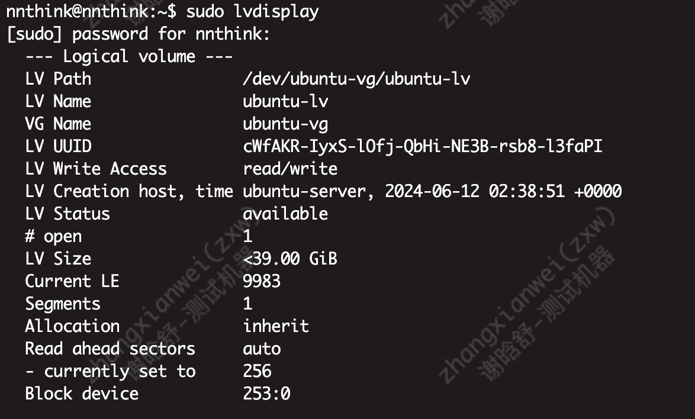
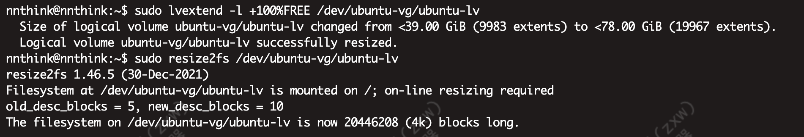
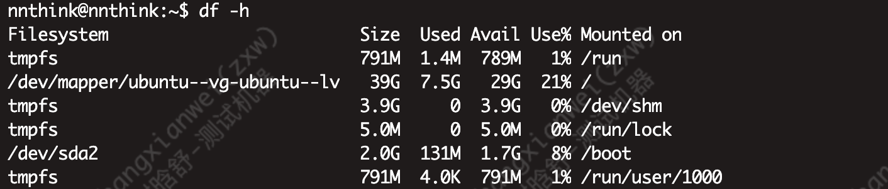
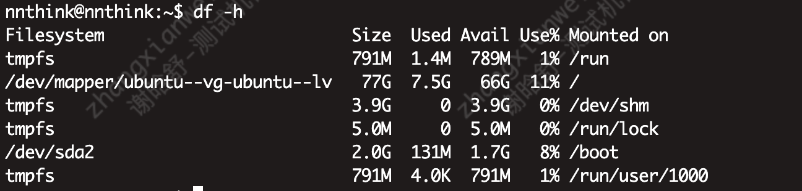

## Ubuntu 逻辑分区LVM扩容

### 必要条件
- 必须是LVM分区
- 磁盘还有未分配的空间

### 一、执行命令lvdisplay查看系统逻辑分区信息
```shell
sudo lvdisplay
```


### 二、扩容
> 【/dev/ubuntu-vg/ubuntu-lv】就是我们要扩容的盘
```shell
sudo lvextend -l +100%FREE /dev/ubuntu-vg/ubuntu-lv
sudo resize2fs /dev/ubuntu-vg/ubuntu-lv
```


### 三、结果，我们可以看到从原来的39G -> 77G

- 扩容前

- 扩容后
